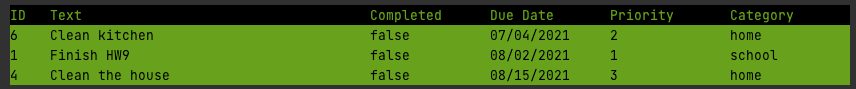

## Example of command line inputs

--csv-file todos.csv --add-todo --todo-text Clean kitchen  --completed true --due 07/04/2021 --priority 2 --category home --complete-todo 3  --display --show-incomplete --sort-by-date  

## Example of Expected Output Display

